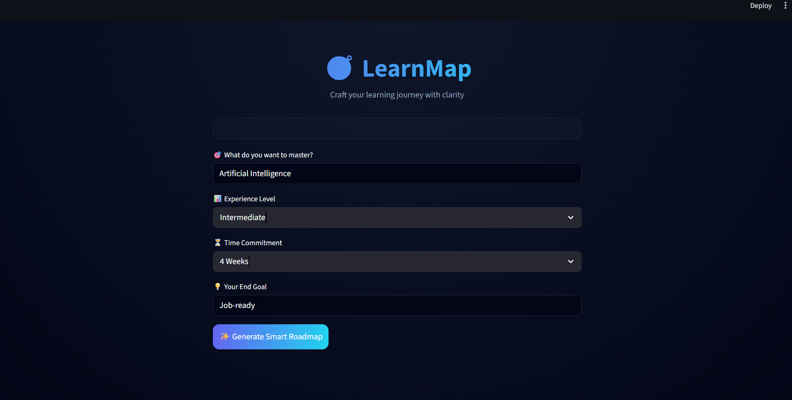
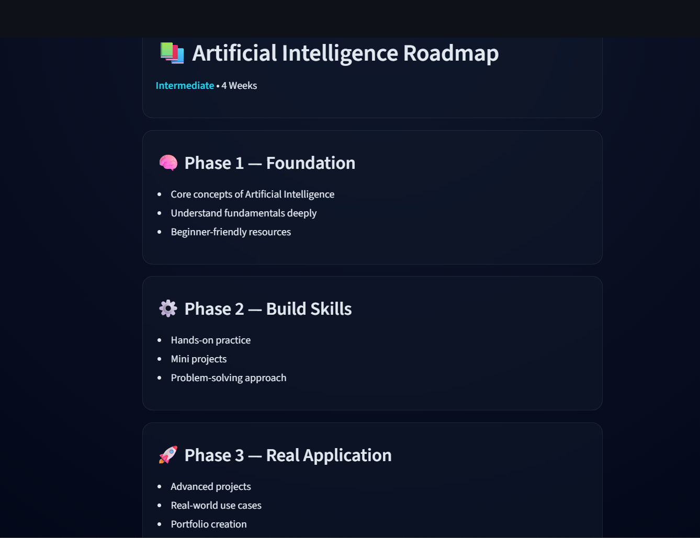

<!-- 🌌 DARK PREMIUM HEADER -->

<p align="center">
  
</p>


<h2 align="center">🧭  Smart Learning Roadmap Generator</h2>

<p align="center">
  <b>Turn confusion into clarity with structured learning paths</b>
</p>

<p align="center">
  
  
  
</p>

---

## 🌈 What is LearnMap?

LearnMap is a **web-based application** that helps users generate a **clear, structured roadmap** to learn any skill.

Instead of randomly learning from different resources, LearnMap provides:

* 📍 A clear starting point
* 🧭 Step-by-step structured guidance
* 🎯 A defined goal

💡 Think of it as:

> **Google Maps for your learning journey**

---

<hr style="border: none; height: 2px; background: linear-gradient(to right, #000000, #0ea5e9, #00f5d4);">

## ⚙️ How is it Built?

LearnMap is built using:

* 🐍 Python → Core logic & processing
* 🌐 Streamlit → Converts Python into a web app
* 🎨 CSS → Styling and UI enhancements

---

<hr style="border: none; height: 2px; background: linear-gradient(to right, #00f5d4, #0ea5e9, #000000);">

## 🧠 System Workflow

```
User Input → Processing Logic → Structured Output
```

---

### 🔹 Input Collection

```python
import streamlit as st

topic = st.text_input("Enter the skill/topic")
level = st.selectbox("Select your level", ["Beginner", "Intermediate", "Advanced"])
duration = st.selectbox("Select duration", ["2 Weeks", "4 Weeks", "8 Weeks"])
```

---

### 🔹 Processing Logic

```python
if level == "Beginner":
    roadmap = "Start with basics → practice → projects"
elif level == "Intermediate":
    roadmap = "Revise basics → build projects → advanced topics"
else:
    roadmap = "Advanced topics → real-world applications"
```

---

### 🔹 Output Display

```python
st.subheader("📚 Your Learning Path")
st.write(roadmap)
```

---

<hr style="border: none; height: 2px; background: linear-gradient(to right, #000000, #0ea5e9, #00f5d4);">

## 🔬 Deep Theory: How the Technology Works

### 🧩 1. Frontend Interaction

Streamlit provides UI components:

```python
st.text_input()
st.selectbox()
st.button()
```

👉 These act as the bridge between user and application

---

### ⚙️ 2. Backend Processing

* Python receives user inputs
* Applies logical conditions
* Generates structured output

👉 This is called **logic-driven computation**

---

### 🧠 3. Structured Learning Model

The roadmap is divided into:

* 🧠 Foundation → Basics
* ⚙️ Practice → Skill building
* 🚀 Application → Real-world projects

👉 Based on **progressive learning theory**

---

### 🔄 4. Execution Model

Streamlit uses a **reactive model**:

👉 Every interaction → script reruns from top to bottom

---

### 💡 Summary

| Layer           | Role               |
| --------------- | ------------------ |
| Input Layer     | Collects data      |
| Logic Layer     | Processes input    |
| Structure Layer | Organizes learning |
| UI Layer        | Displays output    |

---

<hr style="border: none; height: 2px; background: linear-gradient(to right, #00f5d4, #0ea5e9, #000000);">

## 🎯 What is the Actual Use?

Many learners struggle with:

❌ What to learn first
❌ What to learn next
❌ Lack of structure

---

### ✅ LearnMap solves this by:

* Giving a clear roadmap
* Reducing confusion
* Improving efficiency

---

### 🔥 In Simple Words

```
Confusion → Clarity → Action
```

---

<hr style="border: none; height: 2px; background: linear-gradient(to right, #000000, #0ea5e9, #00f5d4);">

## 📸 Screenshots

### 🟢 Input Interface



---

### 🔵 Generated Output



---

<hr style="border: none; height: 2px; background: linear-gradient(to right, #00f5d4, #0ea5e9, #000000);">

## 🛠️ Complete Setup Guide

### 1️⃣ Create Virtual Environment

```bash
python -m venv venv
```

---

### 2️⃣ Activate Environment

```bash
venv\Scripts\activate
```

---

### 3️⃣ Install Dependencies

```bash
pip install streamlit
```

---

### 4️⃣ Create Main File (`app.py`)

```python
import streamlit as st

st.set_page_config(page_title="LearnMap", layout="centered")

st.title("🧭 LearnMap")

topic = st.text_input("Enter topic")
level = st.selectbox("Level", ["Beginner", "Intermediate", "Advanced"])

if st.button("Generate"):
    if topic:
        st.subheader("📚 Your Learning Path")
        st.write(f"Learn {topic} from {level} level → Practice → Build Projects 🚀")
    else:
        st.warning("Please enter a topic")
```

---

### 5️⃣ Run the Application

```bash
python -m streamlit run app.py
```

---

### 6️⃣ Open in Browser

```
http://localhost:8501
```

---

<hr style="border: none; height: 2px; background: linear-gradient(to right, #000000, #0ea5e9, #00f5d4);">

## 🌍 Real-Life Use Cases

### 👨‍🎓 Students

Plan study roadmap

### 👨‍💻 Developers

Learn new technologies

### 🚀 Self Learners

Stay focused

---

<hr style="border: none; height: 2px; background: linear-gradient(to right, #00f5d4, #0ea5e9, #000000);">

## 📚 Where to Learn More

* Roadmap-based learning
* AI in education
* Recommendation systems
* Skill development strategies

---


<!-- 🌊 FOOTER -->

<p align="center">
  
</p>
